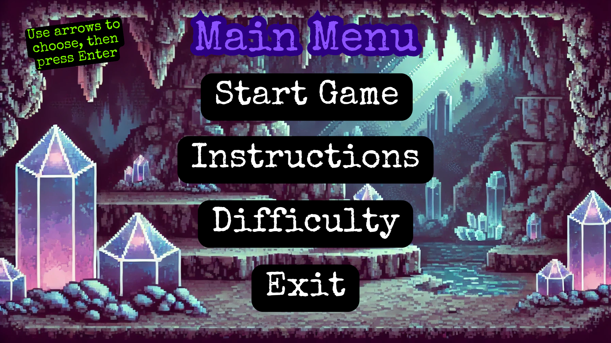
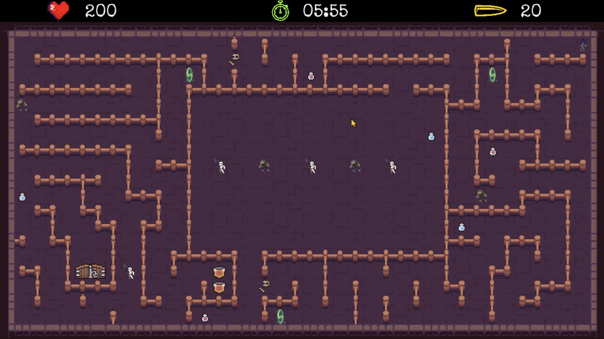

# Maze Puzzle Game

I created a 2D maze game that draws from the classic features of maze games 
while expanding their design into something both recreational and educational.
My aim was to develop a game that is not only entertaining but also stimulates
logical thinking and strategic decision-making. It included puzzles, obstacles,
and power-ups that demand interaction with systems governed by clear rules:
systems that can be precisely modelled and implemented using computational
methods. The maze puzzle game was built using pygame and tkinter.

## Features
- 3 levels of increasing difficulty
- Player movement and collision detection
- 2 types of enemies with different characteristics
- Sound effects for various features
- Shooting mechanics with animation
- Timer and health system
- Randomized puzzles appearing during gametime

## How to Run
If using Windows OS, just open Game_full.exe. Otherwise:
```bash
pip install -r requirements.txt
python main.py
```

## Preview


